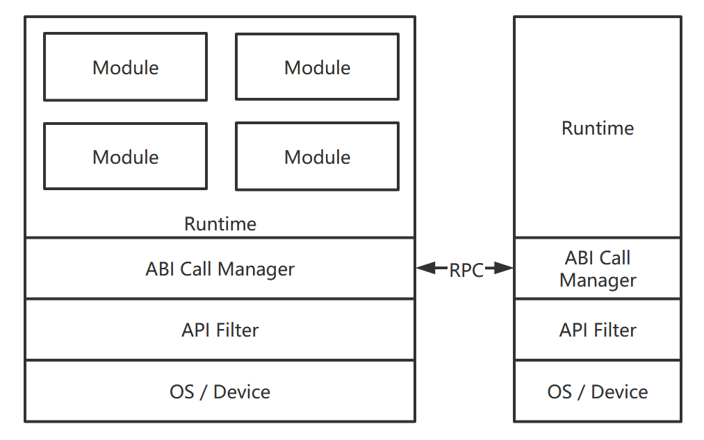

# Marrow

[English](README.md)

`Marrow` 是一个为多样化设备设计的通用运行时， 当前 `Marrow` 使用 `Webassembly` 作为运行时来进行实现。

## 设计

`Marrow` 允许同时加载多个 `Webassembly` 模块，这些模块之间通过CABI进行相互调用。同时 `Marrow` 提供了多个语言可用的标准库 `mw-std` ，这些标准库实现在运行时中，可以实现对模块所运行的节点资源进行访问。

未来 `Marrow` 支持将各个模块以分布式的方式在各个节点上进行使用。最终 `Marrow` 的实现结构如下：

### ABI调用管理器

ABI调用管理器负责各个模块之间进行接口互调，ABI管理器管理的模块之间的接口遵循以下规则：

- 模块间暴露的接口采用CABI对外暴露，函数类型仅支持基本数据类型
- 模块间内存数据传递采用线性内存模型

### ABI拦截器

在模块调用接口访问系统资源或者调用其他模块时，ABI拦截器可以根据预先配置的规则对调用进行拦截，保证模块不会访问未授权的

## 版本计划

### 单节点 Javascript 版本

> 当前版本

单节点 Javascript 版本可以使用

### 单节点 Rust 版本

### 分布式实现
